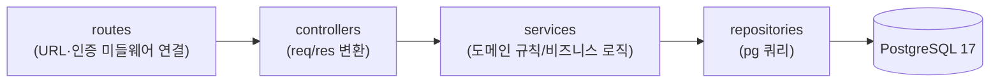
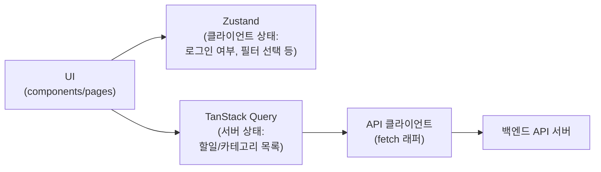

# TodoList 기술 아키텍처 다이어그램

본 문서는 [`docs/2-PRD.md`](./2-PRD.md) 7장(기술 아키텍처 개요)과
[`docs/4-project-structure.md`](./4-project-structure.md) 2장(의존성/레이어 원칙)의
내용을 다이어그램으로 시각화한다. 1인 개발·2일 MVP 규모에 맞춰 실제 구현되는
컴포넌트만 표현하며, 로드밸런서/캐시/메시지 큐/다중 인스턴스 등은 포함하지 않는다.

## 1. 전체 시스템 구성도

브라우저 사용자가 반응형 웹 프론트엔드를 통해 백엔드 API 서버, DB 순으로 요청을
처리하는 최소 구성이다.

```mermaid
flowchart LR
    User["사용자<br/>(PC/모바일 브라우저)"]
    FE["프론트엔드<br/>React 19 + TS<br/>Zustand + TanStack Query"]
    BE["백엔드<br/>Node.js + Express + pg"]
    DB[("PostgreSQL 17")]

    User -->|HTTP 요청| FE
    FE -->|REST API 호출<br/>(JSON, JWT 토큰 첨부)| BE
    BE -->|SQL 쿼리<br/>(파라미터 바인딩)| DB
    DB -->|조회 결과| BE
    BE -->|JSON 응답| FE
    FE -->|화면 렌더링| User
```

## 2. 백엔드 레이어 구조

routes → controllers → services → repositories → PostgreSQL 순의 단방향 의존만
허용하며, 역방향 참조는 금지한다 (project-structure.md 2.2절).



## 3. 프론트엔드 데이터 흐름

UI는 서버 상태(TanStack Query)와 클라이언트 상태(Zustand)를 분리해서 사용하며,
서버 통신은 API 클라이언트 레이어에서만 담당한다 (project-structure.md 2.1절).


