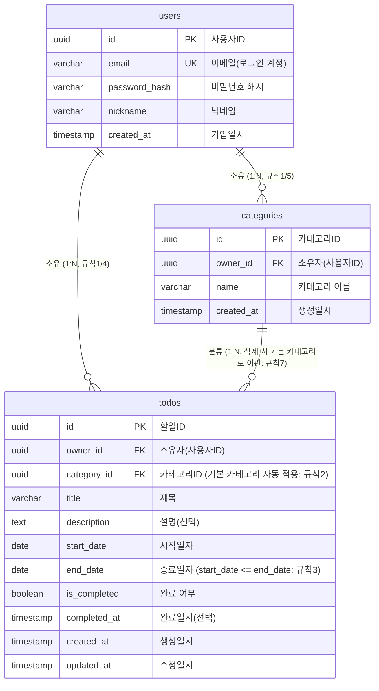

# TodoList ERD (개체-관계 다이어그램)

버전: 1.0 / 작성일: 2026-07-29

본 문서는 [`docs/1-domain-definition.md`](./1-domain-definition.md) 3장(핵심 엔티티)·5장(비즈니스 규칙)과
[`docs/2-PRD.md`](./2-PRD.md) 7.3절(데이터베이스)을 그대로 반영한 users/categories/todos 3개 테이블의
ERD이며, 두 문서와 상충할 경우 도메인 정의서 → PRD 순으로 우선한다([`docs/4-project-structure.md`](./4-project-structure.md) 8장 원칙 동일 적용).

## ERD

## 보충 설명

| 항목 | 설명 |
|---|---|
| 카테고리 삭제 시 FK 정책 | `todos.category_id`에 단순 `ON DELETE CASCADE`를 걸면 규칙7(할일은 삭제되지 않고 '기본' 카테고리로 이관)을 위반한다. DB 제약만으로는 "삭제 전 재할당"을 표현하기 어려우므로, `category-service.js`의 `deleteCategory(categoryId, userId)`가 삭제 트랜잭션 내에서 소속 할일을 '기본' 카테고리 id로 먼저 `UPDATE`한 뒤 카테고리 행을 삭제하는 애플리케이션 레벨 처리를 따른다([`docs/4-project-structure.md`](./4-project-structure.md) 2.2절 services 원칙). FK는 참조 무결성 보장을 위해 `ON DELETE RESTRICT`(또는 애플리케이션이 항상 선행 이관하므로 사실상 도달하지 않는 안전장치)로 두는 것을 권장한다. |
| '기본' 카테고리의 존재 방식 | 도메인 정의서 3.2는 "모든 사용자가 암묵적으로 보유"한다고 정의하지만, PRD 7.3은 "회원가입 시 자동 생성 또는 애플리케이션 레벨 암묵 처리 (설계 시 택1)"로 열어두었다. DB 설계 관점에서는 회원가입(FR-1) 트랜잭션 안에서 `categories`에 실제 '기본' 행을 자동 생성해두는 방식을 권장한다. 이렇게 하면 `category_id`가 항상 유효한 FK를 가지며, 이관 로직(규칙7)도 별도 분기 없이 일반 카테고리와 동일한 `UPDATE` 문으로 처리할 수 있다. |
| 상태(시작전/진행중/완료/기한초과) | 위 ERD에는 상태 컬럼이 존재하지 않는다. 도메인 정의서 4장에 따라 상태는 저장값이 아니라 `is_completed`, `start_date`, `end_date`와 조회 시점의 현재일자를 조합해 매 조회마다 계산되는 파생값이며, `todo-service.js`의 `deriveTodoStatus()`에서 산출한다([`docs/4-project-structure.md`](./4-project-structure.md) 2.2절). |
